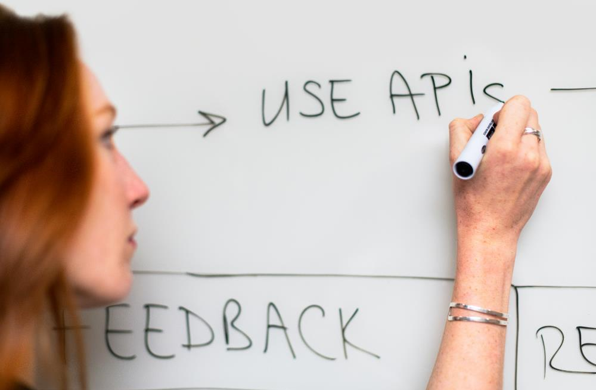

# Data_Engineering
Basic Data Engineering Skills for Data Scientists: Data Collection and Pipelines

## Use Case
The (fictional) businnes use case is the following: Hired as a data engineer for an upcoming start up e-scooter sharing company that rents scooters in different european cities, I was asked to supply them with some data that better helps predicting e-scooter movement.

Ideally, scooters get rearranged organically by having certain users moving from point A to point B, and then an even number of users moving from point B to point A. However, some elements create asymmetries, for example weather and arrivals of tourists in the city:
- On rainy and cold days e-scooter usage decreases drastically.
- Whenever planes with backpack young tourists land, a lot of scooters are needed close to the airport.

So a good way to start is collecting data on weather forecasts and future flight arrivals at city airports. To supply the e-scooter-sharing company with basic data to anticipate scooter movement using Python we will gather data on weather and future flight arrivals using API's and webscraping

## Goal 
In many cases Data Scientists or Data Analysts don’t have access to preprocessed, well structured, cleaned up data ready to use. More often and particularly in small start-ups and companies, employers expect data scientists to have some very basic data engineering skills, to take care of obtaining data themselves, performing ETL operations and setting up databases in the cloud. 

I gathered data from the web using APIs and webscraping techniques, stored it in a database on the cloud with AWS services and automated this process as part of my Data Science Bootcamp at WBS CODING SCHOOL. Here’s how I put together the API requests, parsed the JSON response and put the data into a nice looking dataframe.

## Skills/Tools
Python
JSON Parsing

## Basic Steps in this Project: 

We will first build the pipeline locally and, only once it’s done, we will move to the cloud: we anticipate we will make mistakes, identify needs we were not foreseeing and come up with new ideas along the way. We want all of this to happen as early as possible and in a context where debugging code or altering the design of a database is still easy.

Phase 1: Create a Local Pipeline: 
- Scrape data from the web
- Collect data with APIs
- Store data on a local MySQL instance

Phase 2: Set up Pipeline in the Cloud: 
- Set up a cloud database
- Move scripts to Lambda
- Automate the pipeline 

The deliverable of this project is a written Medium article of what you have accomplished: 
- [Medium Article on Data Collection process with API's]https://medium.com/@rene.markovits/data-engineering-skills-for-data-scientists-c095e01dd82b

## Limitations: 
It’s important to limit the scope of this project: We create a very basic pipeline in the cloud. 
All tech projects start with a simple approach before moving on to more complicated solutions.
- We will not connect our data pipeline to a BI tool. 
- We will not be creating either a data warehouse or a data lake.
- We will not work with big data, data streaming or parallel computing.

## Files in this repository: 

