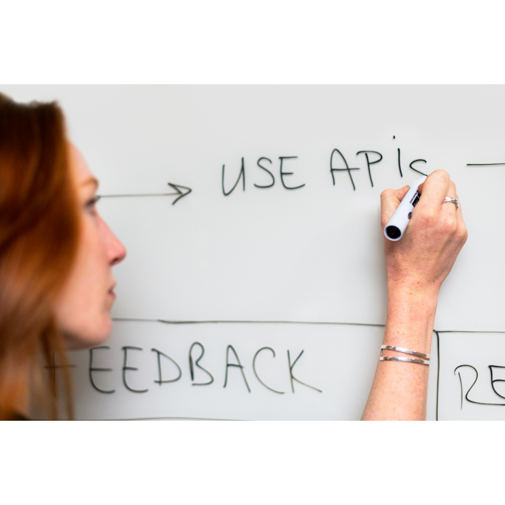

# Data_Engineering
Basic Data Engineering Skills for Data Scientists: Data Collection and Pipelines

## Use Case

## Goal 

## Skills/Tools

## Basic Steps in this Project: 

## Files in this repository: 

